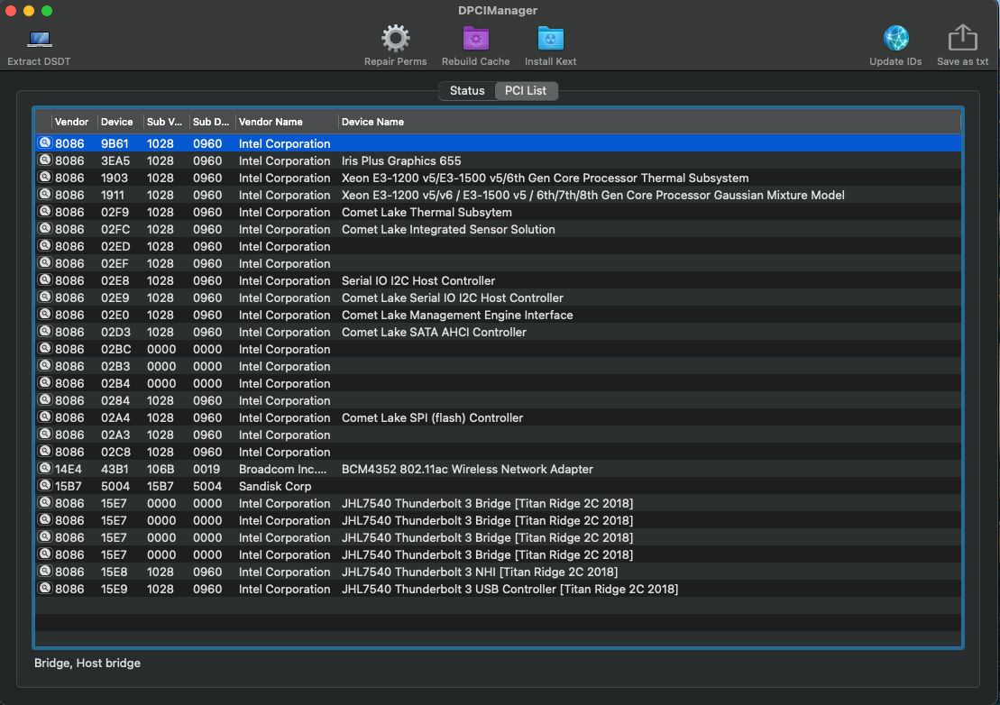

# DELL Inspiron 7391 2in1

### Computer Spec:

| Component        | Brank                              |
| ---------------- | ---------------------------------- |
| CPU              | i7 10510U          |
| iGPU             | Intel® UHD Graphics 620         |    
| Audio            | Realtek ALC295             |
| Ram              | 16 Gb ddr4 2133 Mhz     |            |
| Wifi             | DW1560         |
| NVMe             | WD 512 GB                   
| SmBios           | MacBook Pro 13 16,3          |     
| BootLoader       | OpenCore 0.7.0                    

- [x] Intel Graphics UHD iGPU 
- [x] Intel Graphics UHD iGPU HDMI Output
- [x] IIntel Graphics UHD iGPU Type-C to HDMI Output
- [x] ALC295 Internal Speakers
- [ ] ALC295 Internal microphone (Digital Mic Intel SST not compatible)
- [x] USB MINI Dongle Microphones  *
- [x] ALC295 Combojack headphones
- [ ] ALC295 Combojack microphone (WIP)
- [x] ALC295 HDMI Audio Output
- [x] ALC295 TYPE-C to HDMI Audio Output
- [x] All USB-A 3.1 Ports (TYPE-C 3.2 Included)
- [x] SpeedStep / Sleep / Wake **
- [x] HID Key PWRB & SLPB 
- [x] I2C Touch pad with gesture
- [x] I2C Touch Screen
- [x] Keyboard (PS2-Internal) with backlight
- [x] F6 & F7 Brightness Key
- [x] F10 Print Screen Key
- [x] F1 & F2 & F3 Sound Key
- [x] Wi-Fi and Bluetooth BCM94360NG Module
- [x] Controller SATA III
- [x] Controller NVME PciE Gen3x4 
- [x] Micro SD Cardreader (USB-Internal)
- [x] WebCam (USB-Internal)
- [x] All Sensors CPU, IGPU, BATTERY, NVME, SATA, FAN
- [x] ACPI Battery
- [x] Apple VTD
- [x] NVRAM (Native)
- [x] Recovery (macOS) boot from OpenCore
- [x] Windows 10 boot from OpenCore

## Peripherals & TouchPad Setting 

### Special Config:

- Usb port mapping performed
- SSDT-Hack Essential patch

## Bios settings for Bios Version 1.10.0
### Enable :
* SATA Operation : AHCI
* Fastboot : Thorough
* Integrated NIC : Enable

### Disable : 
* Secure Boot
* Absolute
* TPM2.0 Security On
* Intel SGX
* SMM Security Migration
* Wake on AC
* Wake on Dell USB-C Dock
* Power On Lid Open
* Enable UEFI Network Stack
* Sign Of Life : Early Logo Display / Early keyboard backlight

## Credits

- [Apple](https://apple.com) for macOS;
- [Acidanthera](https://github.com/acidanthera) for OpenCore and all the lovely hackintosh work.
- [Dortania](https://github.com/dortania) For their detailed guides.
- [Vins95](https://github.com/Vins95)
- [Hackintoshlifeit](https://github.com/Hackintoshlifeit)
- [Lorys89](https://github.com/Lorys89/) for making this hack perfect. 
# If you need help please contact us on [Telegram](https://t.me/HackintoshLife_it) 
